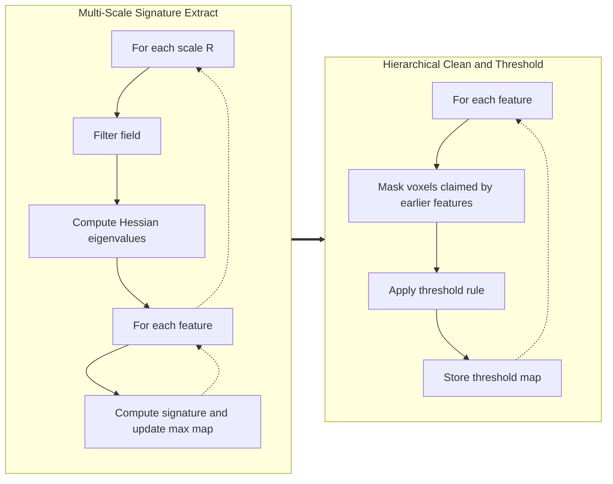

# NeoNEXUS

[](https://julialang.org/)
[](LICENSE)
[](https://github.com/ispirovjr/NeoNEXUS.jl/actions/workflows/CI.yml)
[](https://github.com/ispirovjr/NeoNEXUS.jl/actions/workflows/Documentation.yml)

**NeoNEXUS** is a Julia package for multi-scale, Hessian-based morphology analysis on 3D scalar fields. It provides low-level building blocks for filters, Hessian eigenvalues, feature signatures, thresholding, and connected-component analysis, plus higher-level runners for MMF-style and NEXUS+-style workflows.

The package currently works on 3D arrays and exposes three morphological feature detectors:

- `SheetFeature` for walls / sheets
- `LineFeature` for filaments
- `NodeFeature` for nodes

Full API docs are available at [ispirovjr.github.io/NeoNEXUS.jl](https://ispirovjr.github.io/NeoNEXUS.jl/).

## Installation

```julia
using Pkg
Pkg.add("NeoNEXUS")
```

## Quick Start

The highest-level entry point is `NEXUSPlus`, which builds a node / filament / wall pipeline for a cubic grid:

```julia
using NeoNEXUS

densityPath = joinpath(@__DIR__, "demo/exampleDensity.jld2") # assuming you are in the root directory
density = Float32.(load(densityPath)["grid"])

N = size(density, 1)

scales = [sqrt(2.0)^n for n in 1:4]

runner = NEXUSPlus(N, scales)
thresholds = runner(density)

println(thresholds)
println(sum(runner.wall.thresholdMap))
```

`NEXUSPlus(N, scales)` assumes a cubic grid. For non-cubic grids, custom filters, or lower-level control, construct the filter and feature objects manually and call the features or runners directly.

## Pipeline Overview

The package follows a two-stage workflow: multi-scale signature extraction first, hierarchical thresholding second.



In concrete terms:

1. For each smoothing scale, NeoNEXUS filters the field, computes Hessian eigenvalues once, and evaluates one or more feature signatures.
2. Each feature keeps the voxel-wise maximum signature across scales in `significanceMap`.
3. After the scale loop, thresholding produces binary `thresholdMap`s and optionally masks later features with earlier ones.

## Main Components

### Features

- `SheetFeature`, `LineFeature`, and `NodeFeature` are callable functors.
- Calling a feature on a field returns the signature map for that invocation and updates the feature's stored `significanceMap` with a voxel-wise max.
- Features can reuse a shared `HessianEigenCache` via the `Read`, `Write`, and `None` cache modes.

### Filters

- `GaussianFourierFilter` and `TopHatFourierFilter` smooth fields in Fourier space.
- Both filters provide feature-specific dispatch: node filtering is linear, while the generic `AbstractMorphologicalFeature` path applies log-space filtering.

### Thresholding and Cleanup

- Threshold helpers include flat, volume-based, mass-based, average-density, `deltaMSquaredThreshold!`, and connected-component-based methods.
- Connected components use 6-connectivity.
- Utilities such as `maskSignatureMap!`, `findConnectedComponents`, `pruneSmallComponents!`, and `pruneSmallMassComponents!` support post-processing.

### Runners

- `MMFClassic` runs a configurable feature list across a set of scales, reuses a shared Hessian cache inside each scale, and thresholds features in the order they are supplied with `componentErosionPlateauThreshold!`.
- `NEXUSPlus` provides a fixed node -> filament -> wall workflow. Nodes are thresholded with `findComponentPercentageThreshold!`; filaments and walls are thresholded with `deltaMSquaredThreshold!`.
- `runMultithreaded` parallelizes the scale loop for `NEXUSPlus`.

## Important Notes

- Feature objects and runners are stateful. Their `significanceMap` and `thresholdMap` arrays live on the structs and are reused across calls. Recreate them, or clear those arrays manually, before processing a new dataset.
- `run(runner::NEXUSPlus, densityField)` normalizes the input field to mean density 1 internally.
- The log-filtered NEXUS+ paths are intended for positive density fields. Non-positive values are clamped to `eps(Float32)` before taking `log10`.
- The convenience constructor `NEXUSPlus(gridSize::Int, scales)` is for cubic grids only.

## Repository Demos

The repository includes two demo scripts and a sample density cube:

- `demo/quickStartDemo.jl` loads `demo/exampleDensity.jld2`, runs `NEXUSPlus`, and saves a contour overlay figure.
- `demo/multithreadDemo.jl` compares `run` and `runMultithreaded` on the same input using separate runner instances.
- `demo/exampleDensity.jld2` is the dataset used by both demos.

You can run them from the repository root with:

```bash
julia demo/quickStartDemo.jl
julia --threads=4 demo/multithreadDemo.jl
```

## Project Structure

```text
NeoNEXUS/
|-- src/
|   |-- NeoNEXUS.jl             # Module entry point and exports
|   |-- Types.jl                # Abstract types and cache modes
|   |-- Hessian.jl              # FFT-based Hessian eigenvalue computation
|   |-- Features.jl             # Sheet, line, and node signatures
|   |-- Filters.jl              # Fourier-space smoothing filters
|   |-- Thresholds.jl           # Thresholding and masking utilities
|   |-- ConnectedComponents.jl  # Connected-component analysis and pruning
|   `-- Runner.jl               # MMFClassic and NEXUSPlus runners
|-- test/
|   |-- runtests.jl
|   |-- testHessians.jl
|   |-- testFeatureSignatureMap.jl
|   |-- testFilters.jl
|   |-- testThresholds.jl
|   |-- testConnectedComponents.jl
|   `-- testOrchestration.jl
|-- demo/
|   |-- Project.toml
|   |-- Manifest.toml
|   |-- quickStartDemo.jl
|   |-- multithreadDemo.jl
|   `-- exampleDensity.jld2
`-- docs/
    |-- make.jl
    `-- src/
        |-- index.md
        |-- workflow.md
        `-- api.md
```

## Acknowledgements

The author would like to thank the following people for their contributions and assistance with this project:

- **Rien van de Weygaert** for supervising the project and guiding the work.
- **Konstantin Spirov** for technical guidance and support, especially in the initial stages.
- **Bram Alferink**, **Marius Cautun**, and **Miguel Aragon-Calvo** for prior MMF / NEXUS+ implementations that informed this package.
